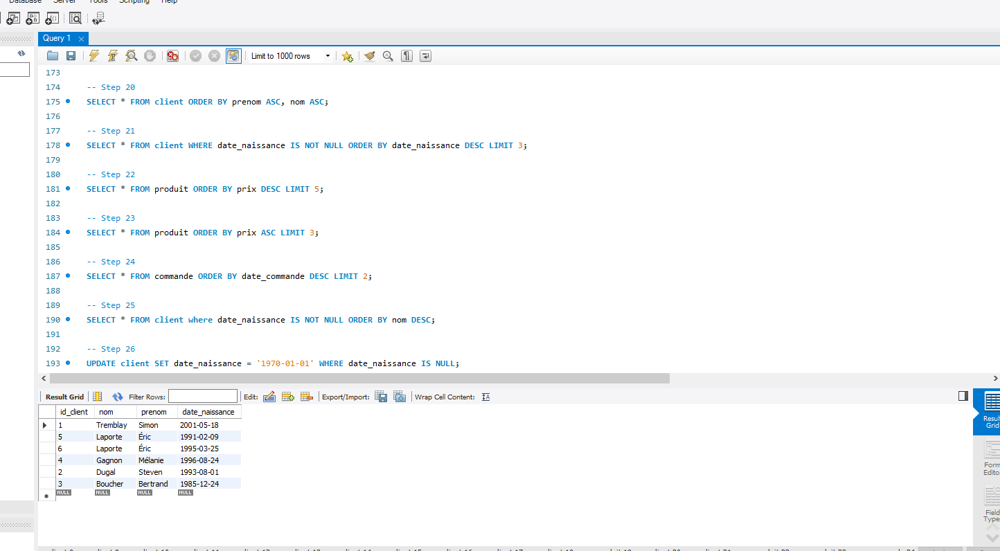

Laboratoire 7 - Recherche de données

  
 
### Project Mock-up 
 
* [Laboratoire07](https://ord15990.gitlab.io/notes-de-cours/module-7/laboratoire-select) 
### Current Project State 
 
* [Project-state](https://github.com/MiguelJerome/mysqllab07/issues) 
 
### Project Resources 
* mysql
        - [distribue](https://github.com/MiguelJerome/mysqllab07/blob/main/distribue%20(2).sql)
        - [solution](https://github.com/MiguelJerome/mysqllab07/blob/main/solution%20(2).sql)
* LAB07
        - [lab07](https://github.com/MiguelJerome/mysqllab07/blob/main/mysqlLab07.sql)        
 
  
## Link for my main for all the ressources
  
You can have access to the resources of my Laboratoire 7 - Recherche de données website [this is the 
link](https://github.com/MiguelJerome/mysqllab07) 
